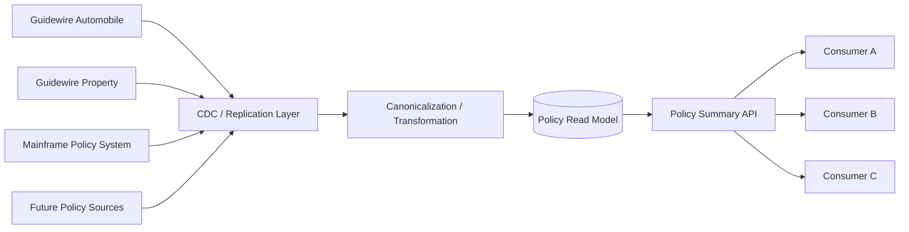

# Policy Summary Modernization

## Architectural Assessment and Read-Replica-Based Policy Read Model

**Document Type:** Solution Architecture / Architecture Decision Proposal
**Status:** Proposed
**Audience:** Architecture Review Board, Engineering Leadership, Application Owners, Platform Teams
**Scope:** Enterprise Policy Summary and Policy Read Use Cases

---

# 1. Executive Summary

The existing **Policy Summary API** was introduced with a sound architectural objective: provide consumers with a simplified policy representation while reducing the need for consumers to interact directly with policy source systems.

However, the current implementation does not fully achieve that objective.

The existing Policy Summary solution maintains a **Policy Summary Database**, but the database currently has limited coverage. It primarily contains **Automobile policy information** and does not provide comprehensive coverage for **Property policies** or **legacy/mainframe policy data**. In addition, for many requests, the Policy Summary API ultimately retrieves information from the source system at runtime.

As a result, the existing solution is not functioning as a true, independent policy read model. It is effectively a combination of:

* A partially populated summary database
* Synchronous integration with source systems
* Source-system-specific data flows
* Consumer-facing abstraction over underlying source-system dependencies

This creates several architectural concerns.

The most significant concern is **tight coupling** between the source systems and the Policy Summary capability. In particular, the synchronous REST integration from Guidewire to the Policy Summary API creates a runtime dependency between two independently managed applications. The reverse dependency also exists when the Policy Summary API calls the source system to satisfy a consumer request.

The resulting architecture can be summarized as:

```text
                 CURRENT STATE

        +----------------------+
        |      Consumer        |
        +----------+-----------+
                   |
                   v
        +----------------------+
        |  Policy Summary API  |
        +-----+-----------+----+
              |           |
              |           |
              v           v
     +----------------+  +------------------+
     | Policy Summary |  |  Source System   |
     |   Database     |  |   Guidewire /    |
     |                |  |   Mainframe      |
     +----------------+  +------------------+
                               ^
                               |
                       Synchronous REST
                       dependency
```

This architecture creates unnecessary runtime dependency on transactional policy systems, limits scalability, complicates resiliency, and makes it difficult to establish a consistent enterprise policy view across multiple policy platforms.

## Recommended Direction

Establish a **Policy Read Model** that is populated asynchronously from **read replicas, CDC pipelines, or equivalent replicated data stores** for all applicable policy source systems.

The target architecture becomes:

```text
                  TARGET STATE

   +--------------------+   +--------------------+
   | Guidewire Auto     |   | Guidewire Property |
   +---------+----------+   +----------+---------+
             |                         |
             | Replication / CDC       | Replication / CDC
             |                         |
             +------------+------------+
                          |
                          v
               +----------------------+
               | Canonicalization /   |
               | Data Transformation   |
               +----------+-----------+
                          |
                          v
               +----------------------+
               |   Policy Read Model  |
               |   / Summary Database |
               +----------+-----------+
                          |
                          v
               +----------------------+
               |  Policy Summary API  |
               +----------+-----------+
                          |
             +------------+-------------+
             |            |             |
             v            v             v
         Consumer A   Consumer B   Consumer C
```

For mainframe systems, the source-specific replication mechanism may be CDC, replicated read storage, or another approved integration technology. The architectural principle remains the same:

> **Consumers should read policy information from a purpose-built Policy Read Model rather than causing runtime calls into transactional policy systems for standard read use cases.**

This approach preserves each policy platform as the **system of record**, while creating a separate **system of consumption** optimized for policy queries.

---

# 2. Business and Architectural Context

The enterprise has multiple policy data sources and multiple classes of consumers that require policy information.

A consumer should ideally be able to ask:

```text
GET /policy/{policyNumber}
```

without needing to know:

* Which policy system owns the policy
* Whether the policy is Automobile or Property
* Whether the policy originates from a mainframe platform
* Which source-specific API must be invoked
* How source-specific authentication works
* Which source system is currently available
* How to handle source-system latency or failure
* How source-system data models are structured

The purpose of a Policy Summary capability should therefore be to provide a **stable, enterprise-friendly policy view**.

The current design only partially provides that abstraction.

---

# 3. Current-State Architecture

## 3.1 Existing Design Intent

The original intent of the architecture appears to have been:

```text
Guidewire
    |
    | REST
    v
Policy Summary API
    |
    v
Policy Summary Database
```

The concept was that the Policy Summary Database would contain the policy information required by consumers, thereby preventing consumers from repeatedly accessing Guidewire.

This would have created the following desirable runtime pattern:

```text
Consumer
    |
    v
Policy Summary API
    |
    v
Policy Summary Database
```

However, the actual behavior is more complex.

---

## 3.2 Actual Runtime Behavior

The current Policy Summary API may retrieve information from the source system when the information required to answer the request is not available in the Policy Summary Database.

The runtime flow can therefore become:

```text
Consumer
    |
    v
Policy Summary API
    |
    +------> Policy Summary Database
    |
    +------> Source System
                |
                v
           Guidewire
```

This is the fundamental architectural issue.

The consumer is not truly independent of the source system.

The Policy Summary API remains a synchronous dependency chain to the transactional source.

---

# 4. Current-State Architectural Deficiencies

## 4.1 The Policy Summary Database Is Not a Complete Read Model

The current Policy Summary Database does not provide comprehensive policy-domain coverage.

Current coverage can be represented as follows:

| Domain                            | Current State              |
| --------------------------------- | -------------------------- |
| Automobile policies               | Supported                  |
| Property policies                 | Not supported              |
| Mainframe policy data             | Not supported              |
| Cross-platform policy view        | Not consistently supported |
| Enterprise-wide policy read model | Not established            |

Because the database is incomplete, the API cannot consistently serve requests from the database alone.

This introduces conditional source-system access:

```text
                     Policy Request
                           |
                           v
                  Policy Summary API
                           |
                   +-------+-------+
                   |               |
            Data available?     Data unavailable?
                   |               |
                  Yes              No
                   |               |
                   v               v
             Summary DB       Source System
```

This means the API has two fundamentally different operating modes:

1. **Database-backed response**
2. **Source-system-dependent response**

From a consumer perspective, both look like the same API.

From an operational and architectural perspective, they are very different.

---

# 5. Tight Coupling Created by the Guidewire REST Integration

## 5.1 Synchronous Application-to-Application Coupling

The REST call from Guidewire to the Policy Summary API introduces direct application-level coupling:

```text
Guidewire
    |
    | REST
    v
Policy Summary API
```

The dependency is not merely informational.

For a synchronous request to succeed, the following must be functional:

* Guidewire
* Policy Summary API
* Network connectivity
* DNS/service discovery
* Authentication/authorization
* API contract
* TLS/certificates where applicable
* API processing
* Policy Summary Database
* Appropriate response time

The upstream application is therefore operationally aware of the downstream application.

---

## 5.2 Temporal Coupling

A synchronous REST call creates **temporal coupling**.

Both applications must be available at the same time for the interaction to complete successfully.

Conceptually:

```text
Guidewire Transaction
        |
        |---- REST Request ---->
        |
        |<--- Response ---------
        |
     Continue
```

If the Policy Summary API is unavailable:

```text
Guidewire
    |
    | REST
    v
Policy Summary API
    |
    X unavailable
```

the outcome depends on timeout, retry, error handling, and whether the Policy Summary interaction is considered mandatory.

This means an application that should logically be independent can potentially become part of the transaction's dependency chain.

---

## 5.3 Operational Coupling

The two applications also become operationally coupled.

A change or outage in the Policy Summary API can affect Guidewire behavior.

Examples include:

* API deployment failures
* Database maintenance
* Authentication failures
* Certificate expiration
* Network outages
* API gateway failures
* Increased API latency
* Unexpected traffic spikes
* Database connection exhaustion

A failure in a downstream summary capability should ideally not become a failure condition for the core policy system.

---

# 6. Runtime Dependency of Policy Summary API on Source Systems

There is also coupling in the opposite direction.

When the Policy Summary API does not have the required data, it calls the source system:

```text
Consumer
    |
    v
Policy Summary API
    |
    | REST
    v
Guidewire
```

Therefore, the resulting dependency graph is effectively:

```text
Guidewire <----> Policy Summary API <----> Consumer
```

The Policy Summary API is neither completely independent from Guidewire nor completely independent from its consumers.

This makes the API a mediator over a runtime dependency chain rather than a true independent read service.

---

# 7. Source-System Availability Coupling

If a consumer requests a policy and the required data is not already available in the Policy Summary Database, the API depends on the source system being available.

For example:

```text
Consumer
   |
   v
Policy Summary API
   |
   v
Guidewire
   |
   X
Source unavailable
```

The consumer's ability to retrieve a policy summary is therefore dependent on Guidewire availability.

This creates an unnecessary coupling between:

> **Policy information availability**

and

> **Transactional source-system availability.**

The two concerns should be separated wherever the business use case allows it.

---

# 8. Performance Coupling

Transactional policy systems should primarily serve transactional and policy-management workloads.

When downstream consumers cause the Policy Summary API to retrieve information from the source system, every new consumer can increase the load placed on the transactional platform.

For example:

```text
Consumer A --\
Consumer B ---\
Consumer C ----> Policy Summary API ---> Guidewire
Consumer D ---/
Consumer E --/
```

If the Policy Summary API receives 10,000 read requests, some proportion of those requests may result in calls to Guidewire.

The Policy Summary API therefore becomes a potential traffic multiplier against the source system.

This creates unnecessary load in the transactional environment.

---

# 9. Scalability Concerns

The architecture couples downstream read traffic to source-system scaling.

As consumers increase:

```text
More Consumers
      |
      v
More Policy Summary Requests
      |
      v
More Source-System Requests
      |
      v
More Guidewire / Mainframe Load
```

This creates an undesirable scaling relationship.

The expected scaling relationship should instead be:

```text
More Consumers
      |
      v
More Read-Model Reads
      |
      v
Scale Read Infrastructure Independently
```

Source-system capacity should not need to grow proportionally with enterprise-wide downstream read traffic.

---

# 10. Failure Propagation and Cascading Failure Risk

A synchronous source-system dependency introduces potential failure propagation.

For example:

```text
Guidewire
   |
   v
Policy Summary API
   |
   v
Slow dependency
```

can result in:

```text
Slow source
    |
    v
Slow Policy Summary API
    |
    v
More waiting requests
    |
    v
Thread / connection exhaustion
    |
    v
Higher failure rate
```

The same pattern can happen in the opposite direction:

```text
Source System
    |
    v
Policy Summary API
    |
    v
Slow / unavailable API
    |
    v
Retry / timeout behavior
    |
    v
Higher load
```

This creates the possibility of a cascading failure.

---

# 11. Retry Amplification

Retries can make a degraded situation worse.

For example:

```text
Guidewire
   |
   | Request
   v
Policy Summary API
   |
   X Timeout
   |
   +---- Retry
            |
            v
       Policy Summary API
            |
            X
```

If multiple instances or transactions retry simultaneously, the source or downstream service can experience amplified traffic.

The architecture should minimize unnecessary synchronous dependencies so that retry behavior is not used to compensate for an architectural coupling problem.

---

# 12. Inconsistent Response Latency

A request served from a database and a request that requires a source-system REST call have different latency profiles.

### Database-backed request

```text
Consumer
   |
   v
Policy Summary API
   |
   v
Read Model
   |
   v
Response
```

### Source-system-backed request

```text
Consumer
   |
   v
Policy Summary API
   |
   v
Network
   |
   v
Source API
   |
   v
Source Application
   |
   v
Source Database
   |
   v
Response
```

The second flow introduces significantly more variables.

As a result, the same API may exhibit highly variable response times based on whether the request can be served locally or requires a source-system call.

This makes latency SLOs and capacity planning more difficult.

---

# 13. Limited Domain Expansion

The current architecture is heavily influenced by the source system that populates the Policy Summary Database.

Because the current implementation is primarily populated for Automobile policies, expanding the solution to Property and mainframe policy data requires additional source-specific integration mechanisms.

A logical consequence is an architecture that gradually grows into:

```text
                       Policy Summary API
                               |
             +-----------------+-----------------+
             |                 |                 |
             v                 v                 v
        Auto System      Property System     Mainframe
```

The more source systems are added, the more the Policy Summary capability becomes responsible for runtime source orchestration.

This increases complexity rather than reducing it.

---

# 14. Lack of a Consistent Enterprise Policy View

An enterprise consumer should ideally see:

```text
Policy
 ├── Policy Details
 ├── Customer
 ├── Drivers
 ├── Vehicles / Property
 ├── Coverages
 ├── Premium
 ├── Status
 ├── Effective Dates
 └── Source Metadata
```

without caring which backend owns each portion of that data.

The current implementation makes the source system part of the runtime decision.

The new architecture can instead create a consistent representation regardless of origin:

```text
Guidewire Auto --------\
Guidewire Property -----\
Mainframe ---------------> Canonical Policy Model
Other sources ----------/
```

This creates a true enterprise policy information capability.

---

# 15. Recommended Architectural Direction

The recommended solution is to establish a **Policy Read Model** as a separate read-oriented data layer.

The basic pattern is:

```text
                 SYSTEMS OF RECORD
                         |
             +-----------+-----------+
             |           |           |
             v           v           v
          Auto       Property     Mainframe
             |           |           |
             +-----------+-----------+
                         |
                  CDC / Replication
                         |
                         v
                Data Transformation
                         |
                         v
              Canonical Policy Model
                         |
                         v
               +-------------------+
               | Policy Read Model |
               +---------+---------+
                         |
                         v
                Policy Summary API
                         |
                         v
                     Consumers
```

---

# 16. Read Replica / CDC as the Decoupling Mechanism

The critical architectural change is how data moves between systems.

### Current Pattern

```text
Source System
     |
     | Synchronous REST
     v
Policy Summary API
```

### Proposed Pattern

```text
Source System
     |
     | Asynchronous replication / CDC
     v
Read Replica / Replicated Store
     |
     v
Policy Read Model
```

The consumer request no longer needs to traverse the source system.

This creates a clear separation between:

* **Data production**
* **Data replication**
* **Data consumption**

---

# 17. System of Record vs. System of Consumption

It is important to explicitly define the role of each layer.

## 17.1 System of Record

The source policy platform remains authoritative for transactional policy information.

Examples include:

* Guidewire Automobile
* Guidewire Property
* Mainframe policy systems

The source system owns the transactional lifecycle.

---

## 17.2 Policy Read Model

The Policy Read Model is a derived representation optimized for reading.

It should support:

* Policy lookup
* Policy summary
* Cross-system policy search
* Consumer queries
* High-volume read workloads
* Consistent API representation

It should **not** become the transactional system of record.

---

# 18. Canonical Data Model

A canonical Policy model should be introduced where appropriate.

Different policy systems will naturally have different structures.

For example:

```text
Guidewire
    |
    +-- Policy
    +-- Policy Period
    +-- Account
    +-- Vehicle
    +-- Coverage

Mainframe
    |
    +-- Policy Record
    +-- Driver Segment
    +-- Vehicle Segment
    +-- Coverage Segment
```

The Policy Read Model can transform those source-specific structures into a consistent model:

```text
                 Canonical Policy
                       |
        +--------------+--------------+
        |              |              |
      Policy        Customer       Risk Item
        |                             |
        |                    +--------+--------+
        |                    |                 |
     Coverage             Vehicle           Property
```

This prevents downstream consumers from becoming coupled to source-specific schemas.

---

# 19. Separation of Read and Write Concerns

The proposed architecture establishes a clean separation:

```text
             WRITE / TRANSACTIONAL SIDE

Consumer
   |
   v
Policy System
   |
   v
System of Record


             READ / CONSUMPTION SIDE

Source Data
   |
   v
Replication / CDC
   |
   v
Policy Read Model
   |
   v
Policy Summary API
   |
   v
Consumers
```

This allows each side to be optimized for its respective purpose.

---

# 20. Resiliency Benefits

The new architecture reduces runtime dependency on the source systems.

Suppose Guidewire becomes temporarily unavailable:

```text
Guidewire
    X
    |
    v
CDC / Replication
```

The Policy Read Model still contains the last successfully synchronized state.

Therefore:

```text
Consumer
   |
   v
Policy Summary API
   |
   v
Policy Read Model
   |
   v
Last Known Policy State
```

The API can continue supporting read use cases for which the available data is acceptable.

This does not eliminate the need for source-system resiliency.

Instead, it prevents every consumer read from being directly dependent on the source system's current runtime availability.

---

# 21. Eventual Consistency

The recommended architecture intentionally introduces **eventual consistency**.

For example:

```text
10:00:00
Policy changed in Guidewire

      |
      | CDC
      v

10:00:01
Change captured

      |
      v

10:00:02
Policy Read Model updated

      |
      v

10:00:03
Consumer sees updated policy
```

The exact latency will depend on the implementation.

The important architectural point is that **data freshness becomes a measurable NFR rather than an implicit dependency on synchronous source access**.

For example:

> The Policy Read Model must reflect 99% of eligible policy changes within the agreed freshness SLA.

---

# 22. Not Every Use Case Should Use the Read Model

The proposed architecture should not be interpreted as:

> "Never call the source system."

There are valid scenarios where the source system remains appropriate.

Examples include:

* Transaction submission
* Policy mutation
* Binding
* Real-time validation requiring authoritative transactional state
* Operations where business rules require the current transaction state

The recommended rule is:

> **Use the Policy Read Model for read-oriented use cases where the defined data-freshness requirement can be satisfied. Use the system of record when authoritative transactional state is required.**

This distinction prevents the read model from being overextended beyond its intended purpose.

---

# 23. Consumer Decoupling

Under the proposed design, consumers no longer need to know the source of the policy.

### Current

```text
Consumer
   |
   v
Policy Summary API
   |
   +--> Automobile source
   |
   +--> Property source
   |
   +--> Mainframe source
```

### Proposed

```text
Consumer
   |
   v
Policy Summary API
   |
   v
Policy Read Model
```

The source-system complexity is moved behind the data-ingestion boundary.

This provides a much cleaner consumer contract.

---

# 24. Source-System Modernization Protection

The proposed architecture also provides protection from future platform changes.

For example, today:

```text
Mainframe
   |
   v
Policy Read Model
```

Later:

```text
New Policy Platform
   |
   v
Policy Read Model
```

The downstream consumers can continue using:

```text
Policy Summary API
```

without necessarily knowing that the source platform has changed.

This is an important strategic benefit because policy-system modernization is expected to occur over time.

---

# 25. Integration Topology Improvement

The existing pattern can result in multiple consumers indirectly driving traffic into multiple policy systems.

Conceptually:

```text
Consumer A ----\
Consumer B -----\
Consumer C ------> Policy Summary API ---> Multiple Sources
Consumer D -----/
```

The proposed pattern centralizes source acquisition:

```text
Guidewire Auto -------\
Guidewire Property ----\
Mainframe --------------> Policy Read Model
Future Sources --------/
                              |
                              v
                       Policy Summary API
                              |
                              v
                          Consumers
```

The result is a cleaner integration topology with fewer runtime dependencies.

---

# 26. Scalability Model

The new architecture separates source-system scaling from consumer scaling.

### Current

```text
Consumer Growth
      |
      v
Policy Summary Traffic
      |
      v
Source System Load
```

### Target

```text
Consumer Growth
      |
      v
Policy Summary Traffic
      |
      v
Read Model Scale
```

Source-system capacity is therefore less directly affected by the growth of downstream read consumers.

---

# 27. Performance Model

A read-oriented data store can be optimized specifically for the queries required by consumers.

Possible optimizations include:

* Query-specific indexing
* Denormalized policy summary structures
* Appropriate partitioning
* Read replicas
* Horizontal scaling
* Caching where appropriate
* Search-oriented indexes where required
* Query-specific projections

The key advantage is that these optimizations can be performed without changing the transactional schema of the source system.

---

# 28. Operational Observability

A dedicated read-model architecture allows data freshness and replication to become explicit operational metrics.

Recommended metrics include:

| Metric                          | Purpose                             |
| ------------------------------- | ----------------------------------- |
| Replication lag                 | Measures source-to-read-model delay |
| Last successful synchronization | Indicates pipeline health           |
| Records/events processed        | Measures throughput                 |
| Failed events                   | Identifies ingestion problems       |
| Dead-letter records             | Identifies persistent data failures |
| Policy Read Model freshness     | Measures consumer-visible freshness |
| API latency                     | Measures consumer experience        |
| API error rate                  | Measures service health             |
| Read Model database health      | Measures storage availability       |

This creates measurable operational behavior that is difficult to achieve when each request dynamically reaches into the source system.

---

# 29. Data Freshness and Data Quality

The new architecture also creates a natural place to enforce data-quality controls.

Examples include:

* Schema validation
* Required-field validation
* Source-to-canonical mappings
* Duplicate detection
* Data lineage
* Record reconciliation
* Replay capability
* Error handling
* Dead-letter processing

The read model therefore becomes more than a copy of source data.

It becomes a governed representation of policy information intended for enterprise consumption.

---

# 30. Security Benefits

The target architecture can reduce direct access to transactional systems.

### Current Model

Multiple downstream flows may ultimately depend on source-system access.

### Target Model

```text
Consumers
    |
    v
Policy Summary API
    |
    v
Policy Read Model
```

Consumers therefore do not require direct access to Guidewire or mainframe environments simply to retrieve policy information.

This provides a stronger security boundary.

---

# 31. Decision Drivers

The architectural decision should be evaluated against the following drivers:

1. **Reduce synchronous coupling**
2. **Remove unnecessary runtime source-system dependency**
3. **Support Automobile, Property, and mainframe policy data**
4. **Provide enterprise-wide policy visibility**
5. **Improve resiliency**
6. **Scale reads independently of transactional systems**
7. **Provide predictable read performance**
8. **Support future source-system modernization**
9. **Provide a canonical consumer-facing policy representation**
10. **Improve observability and operational control**

---

# 32. Architecture Comparison

| Capability                    | Existing Policy Summary       | Proposed Policy Read Model    |
| ----------------------------- | ----------------------------- | ----------------------------- |
| Automobile support            | Yes                           | Yes                           |
| Property support              | No / Limited                  | Yes                           |
| Mainframe support             | No                            | Yes                           |
| Runtime dependency on source  | High                          | Low / None for standard reads |
| Source-system coupling        | High                          | Reduced                       |
| Consumer-to-source dependency | Indirect but present          | Minimized                     |
| Read scalability              | Constrained by source         | Independently scalable        |
| Response latency              | Variable                      | More predictable              |
| Source outage impact          | Potentially high              | Reduced for read use cases    |
| Data freshness SLA            | Difficult to standardize      | Explicit and measurable       |
| Canonical model               | Limited                       | Supported                     |
| Cross-source policy view      | Difficult                     | Natural capability            |
| Security boundary             | More direct source dependency | Stronger abstraction          |
| Future platform migration     | Higher downstream impact      | Lower downstream impact       |

---

# 33. Architectural Principles for the New Solution

## Principle 1 — Systems of Record Remain Authoritative

Guidewire and mainframe platforms remain the authoritative systems for their policy transactions.

The Policy Read Model is derived data.

---

## Principle 2 — Consumers Should Not Be Runtime-Coupled to Source Systems

Consumers should access policy information through the Policy Summary API.

```text
Consumer
    |
    v
Policy Summary API
    |
    v
Policy Read Model
```

---

## Principle 3 — Standard Policy Reads Should Not Require Source-System Calls

A standard policy summary request should be satisfied from the Policy Read Model whenever the use case permits eventual consistency.

---

## Principle 4 — Data Acquisition Should Be Asynchronous

Source changes should be propagated through:

* CDC
* Replication
* Messaging
* Events
* Other approved asynchronous mechanisms

The specific implementation technology may vary by source.

---

## Principle 5 — Canonicalization Should Hide Source Complexity

Source-specific schemas should not become consumer-facing contracts unless there is a specific architectural reason.

---

## Principle 6 — Freshness Must Be Measurable

Every read-model domain must have an agreed freshness target.

---

## Principle 7 — Read and Write Responsibilities Must Remain Separate

The Policy Read Model is optimized for consumption and should not become a second transactional policy system.

---

# 34. Target Logical Architecture



---

# 35. Target Runtime Request Flow

The desired runtime flow for a standard query is:

```text
Consumer
   |
   | GET /policy/{policyNumber}
   v
Policy Summary API
   |
   | Query
   v
Policy Read Model
   |
   | Policy Summary
   v
Policy Summary API
   |
   v
Consumer
```

There should be no normal synchronous call to Guidewire or the mainframe as part of this flow.

---

# 36. Target Data Synchronization Flow

The source-system change flow becomes:

```text
Policy System
     |
     | Policy Change
     v
CDC / Replication
     |
     v
Transformation / Canonicalization
     |
     v
Policy Read Model
```

The source system is therefore responsible for producing authoritative policy changes, while the read platform is responsible for maintaining a usable representation of those changes.

---

# 37. Example End-to-End Flow

Consider a policy update in Guidewire.

```text
1. Policy is updated in Guidewire.

2. Change is captured by CDC / replication.

3. Change is transformed into the canonical policy representation.

4. Policy Read Model is updated.

5. Consumer requests policy summary.

6. Policy Summary API queries the Policy Read Model.

7. Consumer receives policy summary.
```

The consumer does not need to wait for a runtime interaction with Guidewire.

---

# 38. Migration Strategy

The migration should be incremental rather than a big-bang replacement.

## Phase 1 — Establish the New Read Model

Create the new Policy Read Model and ingestion pipeline for Automobile data.

```text
Guidewire Auto
      |
      v
CDC / Read Replica
      |
      v
Policy Read Model
```

Validate:

* Data completeness
* Data quality
* Performance
* Replication latency
* Reconciliation

---

## Phase 2 — Add Property

Extend the same architectural pattern to Property policy data.

```text
Guidewire Auto --------\
                        \
Guidewire Property ------> Policy Read Model
```

The ingestion mechanism should remain standardized even if source-specific implementations differ.

---

## Phase 3 — Add Mainframe

Introduce the mainframe replication/CDC pipeline.

```text
Guidewire Auto --------\
Guidewire Property -----+--> Policy Read Model
Mainframe --------------/
```

The mainframe implementation should transform source-specific structures into the same canonical policy model.

---

## Phase 4 — Consumer Migration

Migrate consumers incrementally.

```text
Consumer
   |
   v
Policy Summary API
   |
   v
New Policy Read Model
```

During migration, the old and new implementations may coexist.

---

## Phase 5 — Remove Runtime Source Dependencies

Once coverage, freshness, and functional parity are established, eliminate unnecessary source-system runtime calls from the Policy Summary API.

The end state becomes:

```text
Consumer
   |
   v
Policy Summary API
   |
   v
Policy Read Model
```

---

## Phase 6 — Retire Legacy Population Pattern

The existing direct Guidewire-to-Policy-Summary REST population mechanism can be retired where the new replication architecture fully replaces its purpose.

This is an important step.

Otherwise, the organization risks maintaining two competing mechanisms for maintaining policy summary data.

---

# 39. Risks and Mitigations

## Risk 1 — Eventual Consistency

**Risk:** Policy data may not be immediately synchronized.

**Mitigation:** Define and monitor explicit freshness SLAs by policy domain and consumer use case.

---

## Risk 2 — Replication Failure

**Risk:** CDC or replication may stop processing changes.

**Mitigation:**

* Monitoring
* Alerting
* Retry
* Dead-letter processing
* Replay
* Reconciliation
* Operational dashboards

---

## Risk 3 — Data Transformation Errors

**Risk:** Source-system data may not map cleanly to the canonical model.

**Mitigation:**

* Explicit source-to-canonical mappings
* Schema validation
* Data-quality checks
* Versioned transformation logic
* Automated reconciliation

---

## Risk 4 — Duplicate Data

**Risk:** The same policy data exists in the source and read model.

**Mitigation:** Clearly define the Policy Read Model as a **derived representation**, not a system of record.

---

## Risk 5 — Stale Data During Source Outage

**Risk:** If a source system is unavailable for an extended period, the read model may become stale.

**Mitigation:** Monitor freshness and communicate the timestamp of the last successful synchronization where required.

---

## Risk 6 — Scope Expansion

**Risk:** The Policy Read Model becomes responsible for every possible policy use case.

**Mitigation:** Maintain strict scope around **read and query use cases** and avoid turning the platform into a second transactional policy system.

---

# 40. Non-Functional Requirements

The new platform should establish measurable NFRs.

## Availability

The Policy Summary API should be independently available from the transactional source systems for supported read use cases.

---

## Data Freshness

A measurable target should be established, for example:

> 99% of eligible policy changes must be reflected in the Policy Read Model within the agreed freshness threshold.

The actual target should be defined by business requirements.

---

## Performance

The Policy Summary API should have predictable response-time objectives based on direct read-model access rather than variable source-system latency.

---

## Scalability

The read layer should scale independently as consumer read traffic grows.

---

## Resiliency

Temporary source-system failures should not automatically cause Policy Summary API failures for previously synchronized policy information.

---

## Observability

The platform should expose:

* Replication lag
* Data freshness
* Processing failures
* Event throughput
* API latency
* API error rate
* Read Model health
* Reconciliation status

---

## Security

Consumers should not need direct connectivity or credentials to the transactional policy systems solely for policy read use cases.

---

# 41. Architectural Trade-Off

The recommended architecture is not without cost.

It introduces:

* Additional data infrastructure
* Replication pipelines
* Transformation logic
* Operational monitoring
* Data governance
* Eventual consistency

However, those are explicit and manageable costs.

The current architecture hides complexity in runtime dependencies.

The architectural choice is therefore essentially:

```text
CURRENT

Lower replication complexity
        +
Higher runtime coupling
        +
Higher source dependency
        +
Lower domain coverage
```

versus:

```text
TARGET

Higher data-pipeline complexity
        +
Lower runtime coupling
        +
Higher resiliency
        +
Independent scalability
        +
Enterprise policy coverage
        +
Better modernization flexibility
```

For an enterprise policy read capability, the second model provides a stronger long-term architectural foundation.

---

# 42. Why Read Replicas Rather Than Direct REST Calls?

The fundamental difference is **when the integration occurs**.

### Direct REST

The integration occurs during the consumer's request.

```text
Consumer Request
      |
      v
Policy Summary API
      |
      v
Source System
      |
      v
Response
```

### Read Replica / CDC

The integration occurs before the consumer request.

```text
Source Change
      |
      v
Replication
      |
      v
Policy Read Model
```

Then:

```text
Consumer Request
      |
      v
Policy Summary API
      |
      v
Policy Read Model
      |
      v
Response
```

This is the fundamental decoupling mechanism.

---

# 43. Why This Is More Than a Performance Optimization

It would be incorrect to characterize the read-replica approach only as a way to improve database performance.

The primary benefit is **architectural decoupling**.

The architecture changes from:

> **Request-time integration**

to:

> **Data-time integration**

The source system and consumer no longer have to participate in the same synchronous request.

That improves:

* Availability isolation
* Failure isolation
* Scalability
* Domain extensibility
* Consumer independence
* Operational control
* Future modernization flexibility

Performance is an important secondary benefit.

---

# 44. Why the Existing Architecture Should Not Be Extended Indefinitely

One option would be to continue expanding the current Policy Summary API by adding more source-system integrations.

For example:

```text
Policy Summary API
    |
    +--> Guidewire Auto
    +--> Guidewire Property
    +--> Mainframe
    +--> Future System 1
    +--> Future System 2
```

This may appear to be an incremental solution.

However, it increases the responsibility of the Policy Summary API from:

> **Policy information service**

to:

> **Runtime enterprise policy integration/orchestration service**

That is a fundamentally different architectural role.

As more systems are added, the API becomes increasingly coupled to:

* Source-specific protocols
* Source-specific schemas
* Source availability
* Source authentication
* Source performance
* Source-specific error handling
* Source-specific retry strategies

This complexity is better handled in the **data ingestion and replication layer**.

---

# 45. Recommended Ownership Boundaries

A clear ownership model should be established.

| Capability                         | Primary Responsibility      |
| ---------------------------------- | --------------------------- |
| Authoritative policy transaction   | Source Policy System        |
| Change capture                     | CDC / Replication           |
| Source-to-canonical transformation | Data / Integration Layer    |
| Policy Read Model                  | Policy Read Platform        |
| Consumer API contract              | Policy Summary API          |
| Consumer-specific presentation     | Consumer / Experience Layer |

This minimizes overlapping responsibilities.

---

# 46. Key Architectural Rule

The following rule should become the central design principle:

> **The Policy Summary API should not be used as a synchronous proxy to transactional policy systems for standard policy read requests.**

Instead:

> **Policy data should be replicated into a purpose-built Policy Read Model, and the Policy Summary API should serve consumers from that read model.**

This should be treated as an architecture principle rather than simply an implementation preference.

---

# 47. Proposed Architecture Decision

## Decision

Build a new **enterprise Policy Read Model** populated from policy source systems through **read replicas, CDC, or equivalent asynchronous replication mechanisms**.

The Policy Summary API will consume the Policy Read Model and provide the enterprise-facing policy summary contract.

The new solution will support:

* Guidewire Automobile
* Guidewire Property
* Mainframe policy data
* Future policy source systems

The source policy systems remain authoritative systems of record.

---

# 48. Decision Rationale

The decision is driven by the following architectural deficiencies in the existing solution:

1. The current Policy Summary Database has incomplete policy-domain coverage.
2. The Policy Summary API frequently depends on runtime source-system calls.
3. The existing Guidewire-to-Policy-Summary REST integration creates synchronous coupling.
4. Source-system availability can directly influence Policy Summary availability.
5. Source-system latency can influence consumer latency.
6. Consumer read traffic can increase transactional-system load.
7. Adding new policy systems increases runtime integration complexity.
8. The current architecture does not provide a consistent enterprise policy read model.
9. Future source-system modernization can create downstream impact.
10. A read-replica/CDC-based architecture provides stronger isolation between transactional and read workloads.

---

# 49. Target End State

The target architecture should ultimately look like:

```text
                    +----------------------+
                    | Guidewire Automobile |
                    +----------+-----------+
                               |
                               |
                    +----------v-----------+
                    | Read Replica / CDC   |
                    +----------+-----------+
                               |
                               |
+-------------------+          |
| Guidewire Property|          |
+---------+---------+          |
          |                    |
          v                    v
+---------+---------+   +------+----------------+
| Read Replica /   |   |                      |
| CDC              +-->|  Canonicalization /  |
+------------------+   |  Data Transformation  |
                       |                      |
+-------------------+  +----------+-----------+
| Mainframe Policy  |             |
| System            |             v
+---------+---------+   +---------+-----------+
          |             |  Policy Read Model  |
          +----------->|                      |
                        +----------+-----------+
                                   |
                                   v
                        +----------------------+
                        |  Policy Summary API  |
                        +----------+-----------+
                                   |
                         +---------+---------+
                         |         |         |
                         v         v         v
                     Consumer  Consumer  Consumer
```

The resulting architecture establishes a clean separation:

```text
                SYSTEMS OF RECORD
                       |
                       |
                Replication / CDC
                       |
                       v
                POLICY READ DOMAIN
                       |
                 Policy Read Model
                       |
                 Policy Summary API
                       |
                       v
                    CONSUMERS
```

---

# 50. Final Recommendation

The existing Policy Summary API should not be expanded indefinitely as a synchronous aggregation layer over transactional policy systems.

The current design has reached a point where the original goal of reducing source-system dependency is no longer being fully achieved.

The recommended modernization is to establish a **true Policy Read Model** backed by replicated data from all relevant policy systems.

The strategic architecture should therefore be:

```text
Source Systems
     |
     | Asynchronous Replication / CDC
     v
Read Replicas / Replicated Stores
     |
     v
Canonical Policy Model
     |
     v
Policy Read Model
     |
     v
Policy Summary API
     |
     v
Consumers
```

The principal architectural benefit is not simply improved performance.

It is the establishment of a clear boundary between:

> **Transactional policy systems that own and maintain policy state**

and

> **A read-oriented policy platform that serves enterprise consumers.**

This separation reduces tight coupling, isolates failures, improves scalability, expands policy-domain coverage, simplifies consumer integration, and creates a more sustainable foundation for future policy-system modernization.

---

# 51. Executive Architecture Statement

The following statement can be used in an Architecture Review Board presentation or decision record:

> **The existing Policy Summary architecture does not fully achieve its intended decoupling objective because the Policy Summary API remains dependent on transactional source systems for a significant portion of read requests, while the current Policy Summary Database provides only partial policy-domain coverage. In addition, the synchronous REST integration between Guidewire and the Policy Summary API introduces application, operational, and temporal coupling.**
>
> **We recommend establishing an enterprise Policy Read Model populated asynchronously from read replicas, CDC, or equivalent replicated data sources across Guidewire Automobile, Guidewire Property, mainframe, and future policy platforms. The Policy Summary API will serve consumers exclusively from this read model for use cases where eventual consistency is acceptable.**
>
> **This architecture preserves the source systems as systems of record while decoupling policy consumption from transactional system availability, performance, and release cycles.**

---

# 52. Architecture Principle to Retain

> ### **Read from the Read Model, Transact with the System of Record.**

This principle captures the intended boundary of the new architecture:

```text
READ
Consumer
   |
   v
Policy Summary API
   |
   v
Policy Read Model


TRANSACT
Consumer / Application
   |
   v
Policy System
   |
   v
System of Record
```

The Policy Read Model should become the **enterprise read boundary for policy information**, while the source systems remain the **authoritative transaction boundary for policy state**.
